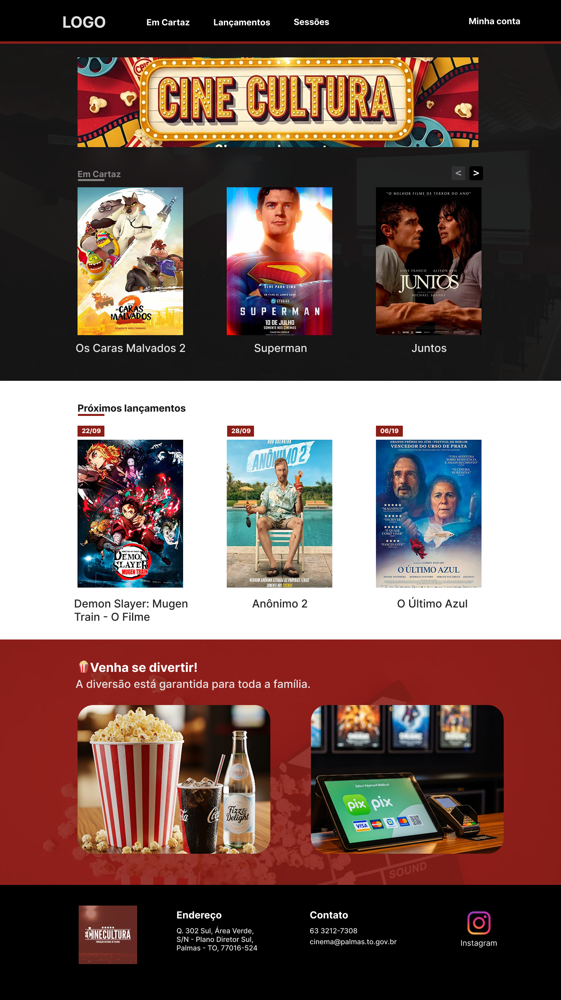

# 🎬 Cine Cultura – Site de Cinema

Projeto de site institucional para o **Cine Cultura**, um cinema local em Palmas-TO, com foco em exibição de filmes em cartaz, lançamentos futuros, promoções e informações de contato.

O site foi desenvolvido com tecnologias web modernas, priorizando **responsividade**, **acessibilidade** e **design atraente**, sendo totalmente funcional em dispositivos móveis e desktop.

---

## 📸 Preview do Projeto

> *Imagem ilustrativa da página inicial.*

---

## 🛠 Tecnologias Utilizadas

- **HTML5** – Estrutura 
- **CSS3** – Estilização personalizada
- **Bootstrap 5** – Framework responsivo
- **Swiper JS** – Carrossel interativo para filmes em cartaz
- **JavaScript** – Funcionalidades dinâmicas
- **AOS js** – Animação

---